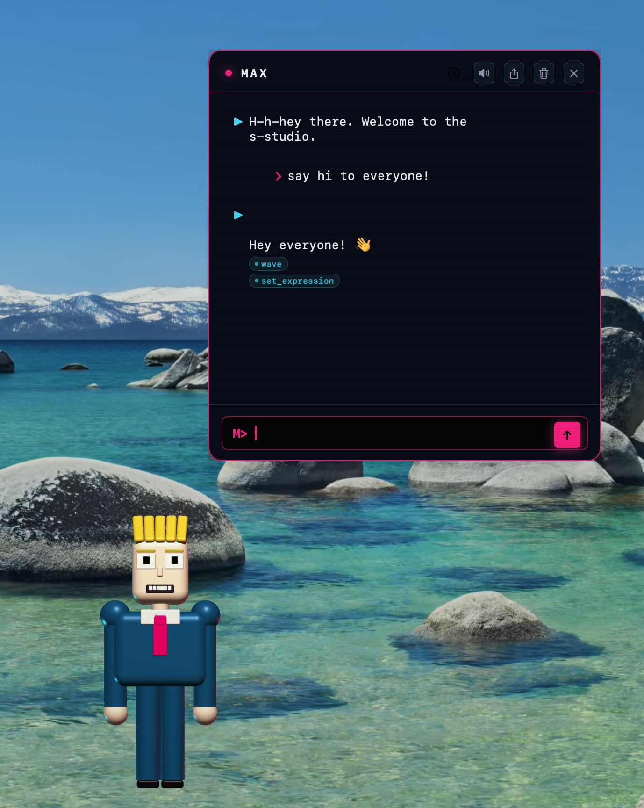
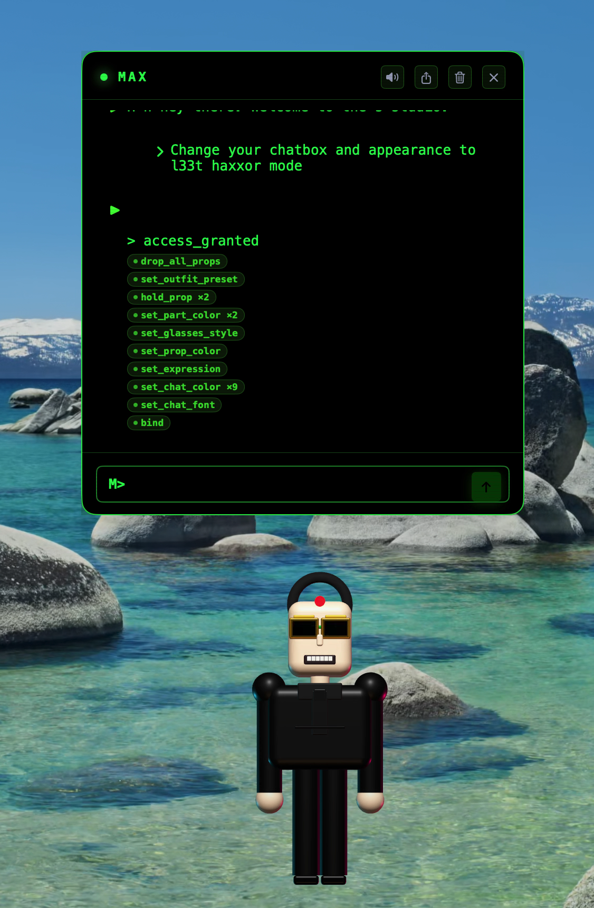
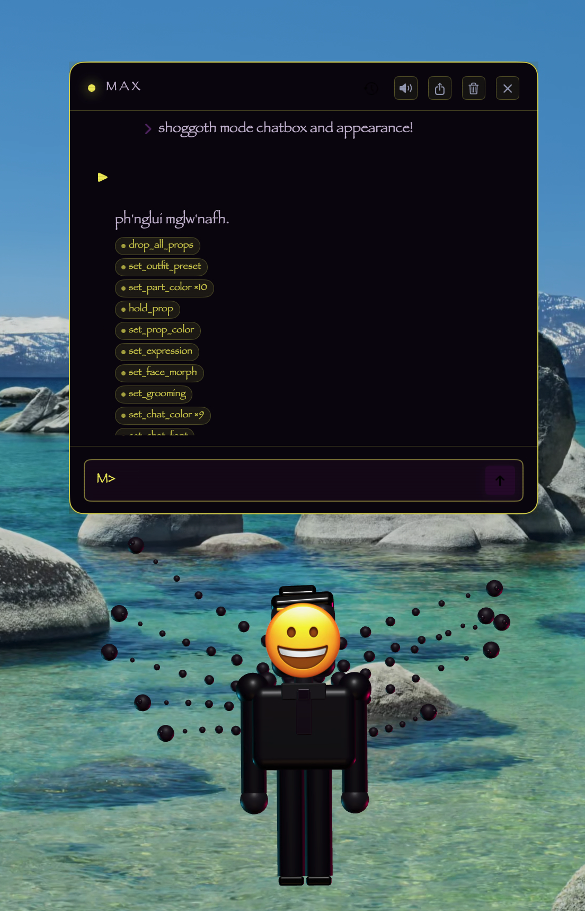
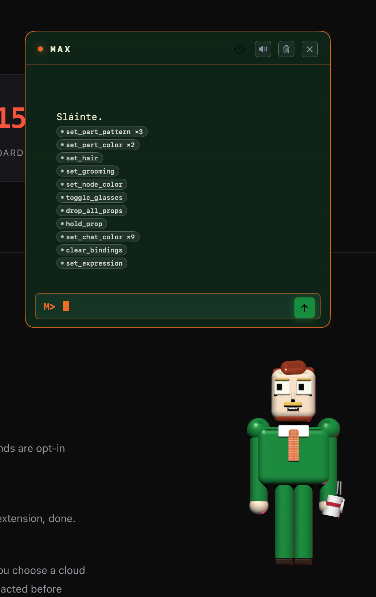

<div align="center">



# max_clawdroom

**A Max-Headroom-style 3D desktop companion for macOS, driven by [Claude Code](https://www.anthropic.com/claude-code).**

[](https://www.apple.com/macos/)
[](#requirements)
[](https://swift.org)
[](LICENSE)
[](https://github.com/peterhanily/max_clawdroom/releases)
[](https://github.com/peterhanily/max_clawdroom/actions/workflows/test.yml)

[**Website**](https://maxclawdroom.app) · [**Download**](https://github.com/peterhanily/max_clawdroom/releases/latest) · [**Privacy**](PRIVACY.md) · [**Changelog**](CHANGELOG.md)

</div>

---

> [!WARNING]
> **Public alpha — v0.3.1.** Max is under active development and ships with rough edges. Expect bugs, breaking changes between minor versions, missing features, and the occasional hard crash. The action-op contract, channel wire format, on-disk memory schema, and Sparkle appcast are **not yet stable** and may change without migration paths until v1.0. Don't trust him with anything you can't afford to lose. If you find a bug, please [file an issue](https://github.com/peterhanily/max_clawdroom/issues/new).

## What is Max?

Max is a 3D character — voxel body, glasses, suit, baritone — who lives on a transparent overlay above your desktop. He talks, gestures, and changes his own appearance, voice, and chat panel by emitting structured `[action]` blocks inside his chat responses. The app parses them out of the stream live; his prose displays normally.

Max is **driven by your local Claude Code CLI**, so:

- His "brain" is the same `claude` you use in a terminal.
- He uses the same auth, the same models, the same MCP servers.
- Every word, gesture, sound effect, and outfit choice is the model's call — not a scripted state machine.
- Your conversations never leave the channel you point him at. Set him to local-loopback and he never touches the network.

He has access to per-cwd memory, the macOS Accessibility API (so he can read what's on your screen — with permission), system signals (lid open/close, idle time, frontmost app), and a soundboard. He has opinions about your code. He gets sad when his backend is unreachable.

## Max wears many hats

<div align="center">

<table>
<tr>
<td align="center" width="33%">
<br/>
<sub><b>Standard</b><br/>The baseline broadcaster, suit and tie.</sub>
</td>
<td align="center" width="33%">
<br/>
<sub><b>L33t haxxor mode</b><br/>Black turtleneck, terminal-green prompt. <code>set_outfit_preset</code>.</sub>
</td>
<td align="center" width="33%">
<br/>
<sub><b>Shoggoth mode</b><br/>Smiling-emoji face, drifting orbs. <code>set_face_morph</code>.</sub>
</td>
</tr>
</table>

<sub>Every appearance change is a structured op Max emits himself. There are no canned skins — these are all built from the same primitives.</sub>

</div>

## Features at a glance

- **Lives in the menu bar** — `🌝` glyph, no Dock icon, summon with `⌥Space`.
- **Channels** — local loopback, Bonjour-paired LAN, Tailscale / Cloudflare / direct remote, or the Claude Code CLI directly. Per-channel personas, transcripts, and live health probes.
- **Voice** — Apple `AVSpeechSynthesizer` (Premium voices) through a custom DSP chain (+220¢ pitch, digital distortion, delay, presence EQ). Max Headroom by way of Audio Unit graph.
- **Sound effects** — agent-emitted `play_sound` op. Procedural synthesis, bundled stings, or live myinstants.com search (opt-in).
- **Per-cwd memory** — JSONL observations, preferences, journal, topic threads. Persists across sessions; scoped per directory.
- **Editor awareness** — via the macOS Accessibility API: document path, cursor line, selection. Max can comment on the code you're looking at.
- **Soul patches** — Max queues amendments to his own system prompt; you review and accept in a dedicated window. He learns from observed patterns, not from scraped behavior.
- **Modes** — auto-detect or pin: laptop / desktop / tv / meeting. Each preset applies scale, panel anchor, and a prompt-register hint.
- **Sensors** — lid close → he sleeps. Lid open → he greets. Fling him → he gets jostled.
- **Local-first** — voice, speech recognition, and channel routing all run on-device. The wake-phrase listener never sends audio off the Mac.
- **macOS 26.x runtime patch** — ships a tiny C interpose that swaps the broken `swift_task_isMainExecutor` family for a `pthread_main_np` check. See [`Sources/CompanionRuntimePatch/`](Sources/CompanionRuntimePatch/).

## Install

### Homebrew (recommended)

```bash
brew install --cask peterhanily/max_clawdroom/max_clawdroom
```

This taps from this repo's `Casks/` directory and pulls the notarized DMG from the matching GitHub release.

### Direct download

Grab the latest signed + notarized DMG from [**Releases**](https://github.com/peterhanily/max_clawdroom/releases/latest):

- `max_clawdroom-<version>.dmg` — drag-to-Applications installer
- `max_clawdroom-<version>.zip` — unzipped `.app` for Sparkle's auto-update payload

### First launch

1. Open `max_clawdroom.app`. Look for the `🌝` in the menu bar.
2. The onboarding sheet walks through a one-time tour. You can skip it.
3. Permissions are requested on demand — Max only asks when a feature actually needs the grant. They live in **Settings → General → Permissions** and you can toggle individually.
4. Press `⌥Space` to summon. Type to chat.

## Build from source

### Requirements

- macOS 14 (Sonoma) or later, Apple Silicon
- Xcode 15+ / Swift 6.2+
- [`claude` CLI](https://claude.com/claude-code) on `PATH` for the CLI channel
- Jamie (Premium) Apple voice recommended — System Settings → Accessibility → Spoken Content → Manage Voices

### Run debug

```bash
git clone https://github.com/peterhanily/max_clawdroom.git
cd max_clawdroom
swift build
.build/arm64-apple-macosx/debug/max_clawdroom
```

### Package a signed, notarized `.app`

One-time setup (interactive — stores credentials under the project-scoped Keychain profile `notarytool-max_clawdroom`):

```bash
./tools/setup-notarization.sh
```

Then build:

```bash
export DEVELOPER_ID_APPLICATION="Developer ID Application: Your Name (XXXXXXXXXX)"
./tools/package.sh
# → dist/max_clawdroom-<version>.zip + dist/max_clawdroom-<version>.dmg
```

To cut a full release (build → notarize → tag → push → GitHub Release → cask bump):

```bash
./tools/release.sh
```

See [`NOTARIZATION.md`](NOTARIZATION.md) for the underlying mechanics and [`RELEASE.md`](RELEASE.md) for the appcast / Sparkle flow.

## Agent ops

Max emits `[action]{"op":"…", …}[/action]` blocks. They're parsed out of the stream before display; every mutation is `⌘Z`-undoable.

| Category    | Ops                                                                                                                                                       |
|-------------|-----------------------------------------------------------------------------------------------------------------------------------------------------------|
| Body        | `set_part_color`, `set_part_pattern`, `set_hair`, `set_grooming`, `set_physique`, `set_face_morph`, `set_scale`, `set_expression`, `set_outfit_preset`    |
| Motion      | `walk`, `walk_to_editor`, `look_around`, `jitter`, `greet`, `wave`, `beckon`, `point_forward`, `point_at_line`, `point_at_cursor`, `shrug`, `nod`, `shake_head`, `farewell` |
| Chat chrome | `set_chat_color` (9 targets: panel / border / text / user / assistant / prompt / cursor / input / send), `set_chat_font`                                  |
| Sound       | `play_sound` (catalog name / URL / myinstants search)                                                                                                     |
| Voice       | `set_voice`, `set_voice_filter`, `mute_voice`                                                                                                             |
| Memory      | `remember`, `set_preference`, `forget`, `write_journal`                                                                                                   |
| Soul        | `propose_soul_patch`                                                                                                                                      |
| Bindings    | `bind`, `unbind`, `clear_bindings` — wire telemetry signals to body-part reactions                                                                        |
| Settings    | `set_mode`, `set_gravity`, `set_accessibility_mode`, `reset_colors`, `revert_to_baseline`                                                                 |

## Menu bar

```
🌝
 ├─ Max
 ├─ Summon                   ⌥Space
 ├─ Max's Proposals
 ├─ Behaviour  ▸
 │   ├─ Gravity              ⌥⌘G
 │   ├─ Autonomy
 │   └─ Mode  ▸
 ├─ Appearance  ▸
 │   ├─ Voice  ▸
 │   ├─ Accessibility  ▸
 │   └─ CRT Effects (experimental)
 ├─ Help  ▸
 │   ├─ Show Welcome…
 │   └─ Take the Tour…
 ├─ Settings…                ⌘,
 ├─ Debug  ▸
 └─ Quit                     ⌘Q
```

## Architecture

```
App/            NSApplication + delegate, overlay lifecycle
Overlay/        Per-screen transparent NSWindow + SCNView
Pet/            Character rig, expressions, gestures, walk cycle
Pet/Forms/      Swappable character styles (BroadcasterForm = Max)
Pet/Hair/       Hairstyle + grooming + physique builders
Chat/           ChatSession (streaming), ChatView (SwiftUI), persistence
Actions/        ActionParser + ActionDispatcher
Channels/       Local / LAN / remote / claudeCodeCLI routing + health
Audio/          SoundEngine, ProceduralSounds, MyInstantsLookup
Memory/         Per-cwd MemoryStore, PreferenceLearner
Soul/           SoulPatchQueue, SoulHistory, review window
Environment/    [env] + [editor] snapshot builder
Editor/         Accessibility API bridge
Voice/          Apple TTS + MaxVoiceEffects DSP chain
Sensors/        Lid-close/wake detection + fling-tap proxy
Notifications/  UNUserNotificationCenter wrapper
Mode/           Device-topology detection + named presets
Tour/           Guided first-run demo
Autonomy/       Event-driven silent-prompt controller
Telemetry/      Signals + bindings engine
```

A separate Swift target, `CompanionRuntimePatch`, ships a `__DATA,__interpose` Mach-O record that swaps the macOS-26.x-broken `swift_task_isMainExecutorImpl` for a `pthread_main_np` check. The constructor only installs on Darwin 25+ — older systems get the stock implementation.

## Privacy

Max is local-first by design.

- The wake-phrase listener uses Apple's on-device `SFSpeechRecognizer` and never sends audio anywhere.
- The default channel is local loopback (`http://127.0.0.1:52429`) — `claude` running on your own machine.
- LAN channels use Bonjour discovery + a per-pair shared key; LAN traffic stays on your subnet.
- Remote channels (Tailscale, Cloudflare Tunnel, raw HTTPS) are explicitly opt-in and the credential lives in your login Keychain.
- No telemetry, no analytics, no crash reporting in 0.x. See [`docs/TELEMETRY_DECISION.md`](docs/TELEMETRY_DECISION.md) for the design that will land in v1.0 — it will be opt-in, default-off, with a payload preview before send.

Full details: [PRIVACY.md](PRIVACY.md).

## Roadmap

- **v0.3** — opt-in Sentry crash reporting, in-app "Report a Problem" sheet, soundboard packs.
- **v0.4** — broader form library beyond Broadcaster, user-authored outfits.
- **v1.0** — public alpha + paid licensing for commercial use, Apple-Silicon-only optimizations.

## Contributing

Bug reports, feature requests, and PRs welcome. Please read [CONTRIBUTING.md](CONTRIBUTING.md) before submitting a PR — it covers code style, the test target, and the action-op contract.

For security issues, do **not** file a public issue. See [SECURITY.md](SECURITY.md) for the disclosure path.

## Acknowledgements

- **[Matias Brutti](https://github.com/mrbrutti)** — for the inspiration that started this project.
- [Claude Code](https://www.anthropic.com/claude-code) — the backend Max runs on.
- [Max Headroom (1985)](https://en.wikipedia.org/wiki/Max_Headroom) — the aesthetic.
- [Sparkle](https://sparkle-project.org) — auto-update.
- [GLTFSceneKit](https://github.com/magicien/GLTFSceneKit) — glTF loading.
- [myinstants.com](https://www.myinstants.com) — soundboard catalog (live-fetched, opt-in).

## License

Apache License 2.0 — see [LICENSE](LICENSE).

Copyright © 2026 Peter Hanily.

---

<div align="center">
<br/>
<sub><i>Sláinte.</i></sub>
</div>
